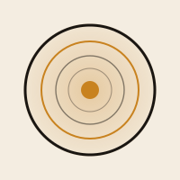

<p align="center">
  
</p>

<h1 align="center">dashi</h1>

> **The essential base for spatial data.**
> A cloud-native spatial data lake — layered, infused, re-usable — consolidating reconnaissance (ISR), mission planning (C2), logistics, and terrain/environment geodata under a common zone-based architecture. Implementation workspace for the _CldGIS Geodatalake_ specification.

**Rendered documentation:** [marcosci.github.io/dashi](https://marcosci.github.io/dashi/)

## Status

- **Phase:** Phase 2 — production hardening in progress (Strang G Prefect-in-cluster ✅, Strang H RBAC / I Observability / J OGC next)
- **Co-Owners:** Marco Sciaini + Johannes Schlund (opendefense)
- **Phase-0 PoC:** ✅ Gate-1 passed, all strands A–F green
- **Target:** Operational readiness within 18 months — military accreditation track deferred
- **Domains:** Aufklärung & ISR · Missionsplanung & C2 · Logistik & Versorgung · **Gelände & Umwelt** (PoC focus)

## About the name

_Dashi_ is the Japanese foundational broth that sits under every layered dish: kombu, bonito, water. Unseen but essential. The platform takes its name from that idea — it's the base that every downstream map, analysis, and mission plan is built on. Visible brand: **dashi**. Original spec document name: _CldGIS Geodatalake_.

## Local docs preview

```bash
python -m pip install -r requirements-docs.txt
mkdocs serve          # http://localhost:8000
```

## Local PoC bootstrap

```bash
cd poc
make k3s-up           # start local k3d / k3s cluster
# ... full target list: make help
```

See [poc/docs/k3s-setup.md](poc/docs/k3s-setup.md) for prerequisites and troubleshooting.

## Repository Layout

```
dashi/
├── README.md                      # This file
├── CLAUDE.md                      # Agent working instructions
├── mkdocs.yml                     # MkDocs Material site config
├── requirements-docs.txt          # Docs site build dependencies
├── .github/workflows/docs.yml     # CI: site build + GitHub Pages deploy
├── docs/                          # Chapter-by-chapter architecture doc + site root
│   ├── index.md                   # MkDocs landing page (public homepage)
│   ├── id-reference.md            # Every F-NN / NF-NN / W-NN / ADR / R-NN lookup
│   ├── GLOSSARY.md                # Acronyms + domain terms
│   ├── adrs.md                    # ADR overview (site nav entry)
│   ├── PHASE-0-ROADMAP.md         # Active spec → PoC roadmap
│   ├── assets/                    # Logo, favicon
│   ├── 01-summary.md … 10-risks-open-questions.md
│   ├── adr → ../adr               # symlink (so MkDocs renders ADRs)
│   └── poc → ../poc               # symlink (so MkDocs renders PoC docs)
├── adr/                           # Architecture Decision Records (per-decision)
│   ├── ADR-001-object-storage.md
│   ├── ADR-002-vector-format-geoparquet.md
│   ├── ADR-003-raster-format-cog.md
│   ├── ADR-004-pointcloud-copc.md
│   ├── ADR-005-table-format.md
│   ├── ADR-006-data-catalog.md
│   ├── ADR-007-processing-engine.md
│   ├── ADR-008-spatial-partitioning-h3.md
│   ├── ADR-009-serving-layer.md
│   ├── ADR-010-pipeline-orchestration.md
│   └── ADR-011-infra-substrate.md
├── source/                        # Archived original PDF for traceability
├── poc/                           # Phase 0 PoC — k3s manifests, ingest pipelines, flows
│   ├── README.md
│   ├── Makefile
│   ├── docs/k3s-setup.md
│   ├── scripts/k3s-up.sh · k3s-down.sh
│   ├── manifests/                 # k8s manifests per component
│   ├── ingest/                    # Python ingestion + standardization
│   ├── flows/                     # Prefect flows
│   ├── smoke/                     # End-to-end acceptance checks
│   └── sample-data/               # (gitignored) local sample datasets
├── agents/                        # Agent-specific task briefs
└── templates/                     # Doc templates (ADR, requirement, risk, question)
```

## Quick Navigation

| Chapter | Topic |
|---------|-------|
| [01](docs/01-summary.md) | Zusammenfassung — executive summary |
| [02](docs/02-context.md) | Kontext & Motivation |
| [03](docs/03-goals.md) | Ziele & Nicht-Ziele |
| [04](docs/04-stakeholders.md) | Stakeholder & Rollen (RACI) |
| [05](docs/05-requirements.md) | Funktionale + nicht-funktionale Anforderungen |
| [06](docs/06-baseline.md) | Ist-Zustand (Greenfield) |
| [07](docs/07-logical-architecture.md) | Zonenmodell (Landing → Processed → Curated → Enrichment → Serving) |
| [08](docs/08-technology-decisions.md) | ADR-Übersicht |
| [09](docs/09-phases.md) | PoC → MVP → Vollbetrieb (18 Monate) |
| [10](docs/10-risks-open-questions.md) | Offene Fragen & Risikoregister |
| [ID-Referenz](docs/id-reference.md) | Lookup aller IDs (F/NF/W/ADR/R) |
| [Glossar](docs/GLOSSARY.md) | Abkürzungen + Fachbegriffe |
| [Phase-0-Roadmap](docs/PHASE-0-ROADMAP.md) | Spec → PoC Arbeitsstränge |

## Working Language

- Architecture content: **German** (source of truth preserved from original spec)
- Agent instructions, commit messages, code, site meta: **English**
