# 9. Phasenplan & Lieferumfang

## Grundprinzip

Die Initiative wird in drei aufeinander aufbauenden Phasen umgesetzt. Jede Phase hat einen klar definierten Lieferumfang, messbare Abnahmekriterien und einen expliziten **Phasenübergangs-Gate** — einen Entscheidungspunkt, an dem der Lenkungsausschuss den Übergang in die nächste Phase formal freigibt.

**Kein Phasenübergang erfolgt automatisch.** Er erfordert die dokumentierte Erfüllung der Abnahmekriterien und die formale Freigabe durch den Initiative Owner.

## Phasenübersicht

```mermaid
gantt
    title dashi — 18-Monats-Plan
    dateFormat X
    axisFormat Monat %s
    section Phase 1
    Proof of Concept (terrain & environment) :p1, 1, 4
    Gate 1                              :milestone, after p1, 0
    section Phase 2
    Minimum Viable Platform (EO + Operations)  :p2, 5, 11
    Gate 2                              :milestone, after p2, 0
    section Phase 3
    Vollbetrieb (Logistik + Hardening)  :p3, 12, 18
    Gate 3                              :milestone, after p3, 0
```



ASCII-Fallback:

```
Monat:  1   2   3   4   5   6   7   8   9   10  11  12  13  14  15  16  17  18
        ├───────────────┼───────────────────────────────────┼──────────────────┤
        │    PHASE 1    │              PHASE 2              │     PHASE 3      │
        │ Proof of Concept │    Minimum Viable Platform    │   Vollbetrieb    │
        └───────────────┴───────────────────────────────────┴──────────────────┘
                        ▲                                   ▲                  ▲
                      GATE 1                              GATE 2            GATE 3
```

---

## Phase 1 — Proof of Concept

**Laufzeit:** Monat 1–4

### Ziel

Validierung der zentralen Architekturannahmen anhand eines vollständigen vertikalen Schnitts durch die Plattform — von der Rohdaten-Ingestion bis zur Bereitstellung eines analysebereit aufbereiteten Produkts. **Nicht Perfektion, sondern Erkenntnisgewinn** ist das Ziel dieser Phase.

### Fokusdomäne

**terrain & environment** — diese Domäne wird als erste umgesetzt, da Geländedaten in der Regel am zugänglichsten sind, keine komplexen Klassifizierungsanforderungen stellen und technisch gut verstanden sind.

### Lieferumfang

**Infrastruktur & Speicher**
- [ ] Objektspeicher-Instanz aufgesetzt und konfiguriert
- [ ] Zonenstruktur (Landing / Processed / Curated) auf Objektspeicher implementiert
- [ ] Zugriffsrechte je Zone definiert und durchgesetzt

**Ingestion**
- [ ] Mindestens zwei Quellformate (z. B. GeoTIFF, GeoPackage) werden automatisch aufgenommen
- [ ] Validierungspipeline (Format, Geometrie, KRS) implementiert und getestet
- [ ] Fehlerprotokollierung bei abgelehnten Lieferungen funktionsfähig

**Verarbeitung**
- [ ] KRS-Transformationspipeline (Landing → Processed) implementiert
- [ ] Konvertierung nach COG und GeoParquet funktionsfähig
- [ ] H3-Partitionierung für Vektordaten implementiert

**Katalog**
- [ ] STAC-Katalog aufgesetzt
- [ ] Automatische STAC-Item-Generierung beim Ingestion-Prozess implementiert
- [ ] Räumliche und zeitliche Suche im Katalog funktionsfähig

**Serving**
- [ ] SQL-Zugriff auf GeoParquet-Daten in der Curated Zone funktionsfähig
- [ ] COG-Kacheldienst (TiTiler) für Rasterdaten funktionsfähig

**Bestandsaufnahme**
- [ ] Stakeholder-Interviews aller vier Domänen durchgeführt
- [ ] Dateninventar je Domäne erhoben und dokumentiert
- [ ] Quellsysteme und Schnittstellentypen inventarisiert
- [ ] Kapitel 6 dieses Dokuments vollständig befüllt

**Offene Entscheidungen**
- [ ] ADR-005: Iceberg vs. Delta Lake entschieden
- [ ] ADR-007: Verarbeitungs-Engine entschieden
- [ ] ADR-010: Pipeline-Orchestrierung entschieden
- [ ] Technischer Metadatenkatalog ausgewählt

### Abnahmekriterien — Gate 1

| Kriterium                        | Messung                                     | Zielwert    |
|----------------------------------|---------------------------------------------|-------------|
| End-to-End-Pipeline funktionsfähig | Manueller Test: Datei rein, STAC-Item raus | Bestanden   |
| KRS-Transformation korrekt       | Stichprobenprüfung von 10 Datensätzen      | 100% korrekt |
| STAC-Suche funktionsfähig        | Bounding-Box-Abfrage liefert korrektes Ergebnis | Bestanden |
| SQL-Abfrage auf Curated Zone     | Einfache Abfrage liefert Ergebnis in < 10 Sek. | Bestanden |
| Alle offenen ADRs entschieden    | Review durch Platform Architect             | Bestanden   |
| Bestandsaufnahme abgeschlossen   | Kapitel 6 vollständig                       | Bestanden   |
| Sicherheitsbeauftragter eingebunden | Kickoff-Meeting dokumentiert              | Bestanden   |

---

## Phase 2 — Minimum Viable Platform

**Laufzeit:** Monat 5–11

### Ziel

Aufbau einer produktionsfähigen Plattform für die ersten zwei priorisierten Domänen. Onboarding realer Konsumenten-Teams. Härtung der Pipelines unter echten Betriebsbedingungen. Etablierung von Governance und Betriebsprozessen.

### Fokusdomänen

**Earth observation** sowie **operational planning** werden in dieser Phase onboardet. **terrain & environment** aus Phase 1 wird in den Produktivbetrieb überführt.

### Lieferumfang

**Plattform-Härtung**
- [ ] Pipeline-Orchestrierung produktiv betrieben (Scheduling, Monitoring, Alerting)
- [ ] Automatisches Retry-Verhalten bei Pipeline-Fehlern implementiert
- [ ] Backup- und Recovery-Prozesse definiert und getestet
- [ ] Zentrales Monitoring-Dashboard für alle Pipelines operativ

**Domänen-Onboarding: terrain & environment (Produktivbetrieb)**
- [ ] Alle bekannten Quellsysteme angebunden
- [ ] Dateneigentümer formal benannt und eingewiesen
- [ ] Curated-Zone-Produkte durch Dateneigentümer freigegeben
- [ ] Erste Konsumenten-Teams aktiv

**Domänen-Onboarding: Earth observation**
- [ ] Quellsysteme inventarisiert und Ingestion-Adapter entwickelt
- [ ] Klassifizierungsanforderungen mit Sicherheitsbeauftragtem abgestimmt
- [ ] EO-spezifische STAC-Extensions definiert
- [ ] Curated-Zone-Produkte durch Dateneigentümer freigegeben

**Domänen-Onboarding: operational planning**
- [ ] Schnittstellen zu bestehenden operational-Systemen definiert und implementiert
- [ ] Vektorkacheldienst für operational planningsprodukte produktiv
- [ ] OGC-Dienste (WMS/WFS) für externe Systemanbindung produktiv

**Katalog & Metadaten**
- [ ] Technischer Metadatenkatalog produktiv betrieben
- [ ] Lineage für alle aktiven Pipelines dokumentiert und maschinell abfragbar
- [ ] Datenqualitätsmetriken automatisch erhoben und visualisiert

**Governance**
- [ ] Dateneigentümerschaft für alle aktiven Domänen formal zugewiesen
- [ ] Schemaänderungsprozess definiert und kommuniziert
- [ ] Onboarding-Dokumentation für neue Datenlieferanten erstellt
- [ ] Erster Steuerungskreis etabliert und regelmäßig tagend

**Sicherheit**
- [ ] Rollenbasierte Zugriffskontrolle auf Zonen- und Domänenebene produktiv
- [ ] Vollständiges Audit-Logging aktiv
- [ ] Compliance-Audit-Prozess für Zielbetriebsumgebung eingeleitet

### Abnahmekriterien — Gate 2

| Kriterium            | Messung                                 | Zielwert              |
|----------------------|-----------------------------------------|-----------------------|
| Drei Domänen produktiv | Aktive Konsumenten in allen drei Domänen | Bestanden           |
| Pipeline-Stabilität  | Fehlerrate über 30 Tage                 | < 5%                  |
| Abfrageperformance   | Bounding-Box-Abfrage Curated Zone       | < 5 Sekunden          |
| Katalogvollständigkeit | Anteil katalogisierter Datensätze      | > 95%                 |
| Governance etabliert | Alle Dateneigentümer benannt und aktiv  | Bestanden             |
| Sicherheit           | Compliance-Audit-Prozess eingeleitet      | Bestanden             |
| Nutzerzufriedenheit  | Feedback-Runde mit Konsumenten-Teams    | Keine kritischen Blocker |

---

## Phase 3 — Vollbetrieb

**Laufzeit:** Monat 12–18

### Ziel

Vollständiger Produktivbetrieb über alle vier Domänen. Abschluss der Compliance-Audit. Übergabe der operativen Verantwortung an ein dauerhaft besetztes Betriebsteam. Vorbereitung der Plattform für KI/ML-Workloads.

### Fokusdomäne

**logistics & supply chain** wird als letzte Domäne onboardet. Parallel: Härtung, Optimierung und Übergabe aller bestehenden Domänen.

### Lieferumfang

**Domänen-Onboarding: logistics & supply chain**
- [ ] Alle Quellsysteme angebunden
- [ ] Logistikspezifische Datenprodukte in Curated Zone produktiv
- [ ] Verschneidung mit Gelände-Produkten (Enrichment Zone) produktiv

**Plattform-Optimierung**
- [ ] Performance-Optimierung aller aktiven Pipelines
- [ ] Storage-Tiering (heiß / warm / kalt) implementiert
- [ ] Kostenmonitoring und -optimierung aktiv

**KI/ML-Vorbereitung**
- [ ] Feature-Store-Schnittstelle für ML-Pipelines definiert und implementiert
- [ ] Exportpipeline für Trainingsdaten (Bildkacheln, Annotationen) produktiv
- [ ] Erste ML-Pilotanwendung auf Plattformdaten validiert

**Sicherheit & Compliance-Audit**
- [ ] Compliance-Audit für Zielbetriebsumgebung abgeschlossen
- [ ] Penetrationstest durchgeführt und Findings adressiert
- [ ] Notfallprozesse (Incident Response) dokumentiert und geübt

**Betriebsübergabe**
- [ ] Betriebsdokumentation vollständig
- [ ] Runbooks für alle kritischen Prozesse erstellt
- [ ] Betriebsteam eingewiesen und eigenständig betriebsfähig
- [ ] SLA-Monitoring aktiv

**Interoperabilität**
- [ ] Schnittstellen zu Partnersystemen definiert und ggf. implementiert
- [ ] Standardkonformität (OGC, ISO 19115, STAC) geprüft und dokumentiert (soweit relevant)

### Abnahmekriterien — Gate 3

| Kriterium                | Messung                               | Zielwert    |
|--------------------------|---------------------------------------|-------------|
| Alle vier Domänen produktiv | Aktive Konsumenten in allen vier Domänen | Bestanden |
| Compliance-Audit abgeschlossen | Formales Compliance-Auditsdokument vorhanden | Bestanden |
| Verfügbarkeit            | Messung über 60 Tage                  | > 99,5%     |
| Pipeline-Stabilität      | Fehlerrate über 60 Tage               | < 2%        |
| Betriebsübergabe         | Betriebsteam eigenständig betriebsfähig | Bestanden |
| Dokumentation            | Review durch Platform Architect       | Vollständig |
| KI/ML-Readiness          | Erste ML-Pipeline auf Plattformdaten lauffähig | Bestanden |

---

## 9.1 Meilensteinübersicht

| Meilenstein                  | Phase | Zieldatum | Verantwortlich         |
|------------------------------|:-----:|-----------|------------------------|
| Kick-off & Teamaufstellung   | 1     | Monat 1   | Initiative Owner       |
| Bestandsaufnahme abgeschlossen | 1   | Monat 3   | Platform Architect     |
| End-to-End-Pipeline PoC      | 1     | Monat 4   | Platform Team          |
| Gate 1 — Freigabe Phase 2    | 1→2   | Monat 4   | Lenkungsausschuss      |
| EO-Domäne produktiv         | 2     | Monat 8   | Data Owner Earth Observation         |
| operational-Domäne produktiv          | 2     | Monat 9   | Data Owner Operations          |
| Compliance-Audit-Prozess eingeleitet | 2 | Monat 9 | Security Engineer      |
| Gate 2 — Freigabe Phase 3    | 2→3   | Monat 11  | Lenkungsausschuss      |
| Logistik-Domäne produktiv    | 3     | Monat 15  | Data Owner Logistik    |
| Compliance-Audit abgeschlossen | 3     | Monat 16  | Sicherheitsbeauftragter |
| Betriebsübergabe abgeschlossen | 3   | Monat 17  | Platform Lead          |
| Gate 3 — Projektabschluss    | 3     | Monat 18  | Lenkungsausschuss      |

## 9.2 Abhängigkeiten & kritischer Pfad

Die folgenden Abhängigkeiten sind kritisch — eine Verzögerung hier verzögert die gesamte Initiative:

- **Infrastrukturverfügbarkeit:** Die Objektspeicher-Infrastruktur muss zu Beginn von Phase 1 verfügbar sein. Beschaffungsprozesse müssen parallel zum Dokumentationsprozess eingeleitet werden.

- **Datenzugang durch Quellsysteme:** Jede Domäne kann erst onboardet werden, wenn die Datenlieferanten Exportschnittstellen bereitstellen. Frühzeitige Abstimmung mit allen Quellsystem-Betreibern ist zwingend.

- **Compliance-Audit:** Der Compliance-Audit-Prozess hat eine lange Vorlaufzeit und muss spätestens in Phase 2 eingeleitet werden, um Gate 3 nicht zu gefährden.

- **Dateneigentümer-Benennung:** Ohne formal benannte Dateneigentümer können Curated-Zone-Produkte nicht freigegeben werden. Die Benennung muss vor dem jeweiligen Domänen-Onboarding abgeschlossen sein.
