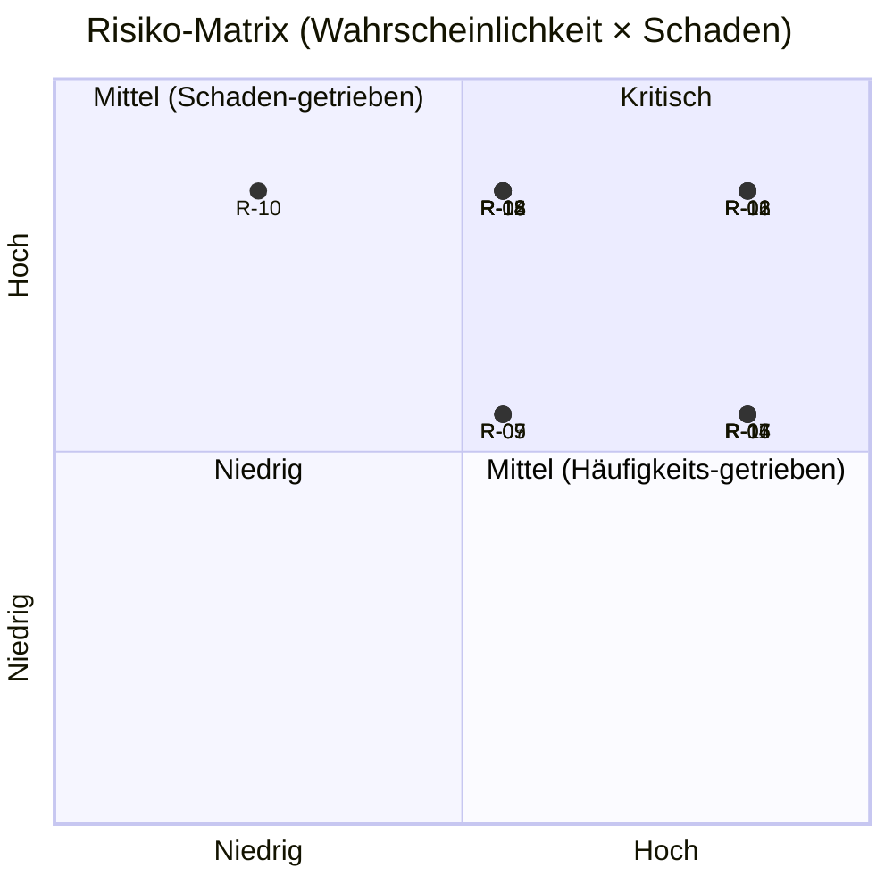

# 10. Offene Fragen & Risiken

## Grundprinzip

Dieses Kapitel ist ein lebendes Dokument. Es wird kontinuierlich aktualisiert und ist fester Bestandteil jeder Steuerungskreis-Sitzung. Offene Fragen und Risiken werden nicht als Schwäche des Dokuments betrachtet — ihre explizite Benennung ist ein Zeichen architektonischer Reife.

### Statuslegende

- 🔴 **Kritisch** — unmittelbarer Handlungsbedarf
- 🟡 **Offen** — Klärung erforderlich, noch kein Blocker
- 🟢 **Geklärt** — dokumentiert, kein weiterer Handlungsbedarf
- ⏸️ **Zurückgestellt** — bewusst auf spätere Phase verschoben

---

## 10.1 Offene Fragen

Offene Fragen sind ungeklärte Sachverhalte, die eine Entscheidung oder Information erfordern, bevor die betroffenen Architektur- oder Planungsbereiche abgeschlossen werden können.

| ID   | Frage | Bereich | Verantwortlich | Benötigt bis | Status |
|------|-------|---------|----------------|--------------|:------:|
| F-01 | Welche Klassifizierungsstufen müssen auf der Plattform verarbeitet werden — und in getrennten oder gemeinsamen Zonen? | Sicherheit / Architektur | Sicherheitsbeauftragter | Ende Phase 1 | 🔴 |
| F-02 | Welche Infrastruktur steht zur Verfügung — Cloud, on-premise oder hybrid? Gibt es bestehende Verträge oder Vorgaben? | Infrastruktur | Initiative Owner | Monat 1 | 🟢 |
|   | **Geklärt 2026-04-23:** PoC läuft auf lokalem k3s-Cluster, entwickelt im GitHub (marcosci/dashi). Siehe [ADR-011](adr/ADR-011-infra-substrate.md). | | | | |
| F-03 | Gibt es Echtzeit-Anforderungen aus dem C2-Bereich, die eine gesonderte Architekturkomponente erfordern? | Architektur / C2 | Data Owner C2 | Ende Phase 1 | 🟡 |
| F-04 | Welche externen Systeme — Bündnispartner, nationale Behörden, NATO-Infrastruktur — müssen angebunden werden? | Interoperabilität | Initiative Owner | Phase 2 Start | 🟡 |
| F-05 | Wie lange müssen Rohdaten in der Landing Zone aufbewahrt werden? Gibt es gesetzliche oder regulatorische Archivierungsfristen? | Governance / Recht | Initiative Owner | Ende Phase 1 | 🟡 |
| F-06 | Welche Quellsysteme haben keine standardisierten Exportschnittstellen und erfordern individuelle Konnektoren? | Ingestion | Data Owner je Domäne | Ende Phase 1 | 🟡 |
| F-07 | Ist eine NATO-STANAG-Konformität für bestimmte Datensätze oder Schnittstellen vorgeschrieben? | Interoperabilität / Recht | Initiative Owner | Phase 2 | 🟡 |
| F-08 | Welches Koordinatenreferenzsystem ist organisationsweit verbindlich vorzuschreiben — oder muss dies in Phase 1 erst entschieden werden? | Architektur | Platform Architect | Ende Phase 1 | 🟡 |
| F-09 | Wer trägt die Betriebsverantwortung nach Abschluss von Phase 3 — ein dediziertes Team, eine bestehende IT-Einheit oder ein externer Dienstleister? | Betrieb / Organisation | Initiative Owner | Phase 2 | 🟡 |
| F-10 | Gibt es Anforderungen an Offline-Betrieb oder eingeschränkte Konnektivität (z. B. taktische Randlagen ohne Netzanbindung)? | Architektur / Betrieb | Data Owner C2 / ISR | Ende Phase 1 | 🟡 |

---

## 10.2 Risikoregister

Das Risikoregister erfasst alle bekannten Risiken mit ihrer Eintrittswahrscheinlichkeit, ihrem potenziellen Schaden und der definierten Gegenmaßnahme.

### Bewertungsschema

| Wahrscheinlichkeit × Schaden       | Risikostufe  |
|------------------------------------|--------------|
| Hoch × Hoch                        | 🔴 Kritisch  |
| Hoch × Mittel oder Mittel × Hoch   | 🟠 Hoch      |
| Mittel × Mittel oder Niedrig × Hoch | 🟡 Mittel   |
| Niedrig × Niedrig oder Niedrig × Mittel | 🟢 Niedrig |

### Organisatorische Risiken

| ID   | Risiko | Wahrsch. | Schaden | Stufe | Gegenmaßnahme | Verantwortlich |
|------|--------|----------|---------|:-----:|---------------|----------------|
| R-01 | Dateneigentümer verweigern oder verzögern den Datenzugang aus Kontrollbedenken | Hoch | Hoch | 🔴 | Frühzeitige Einbindung der Dateneigentümer in die Governance-Struktur; klare Zusagen zu Datensouveränität und Zugriffsrechten | Platform Architect |
| R-02 | Fehlende oder wechselnde Unterstützung durch das Führungspersonal über die Projektlaufzeit | Mittel | Hoch | 🟠 | Lenkungsausschuss mit ausreichend Entscheidungsbefugnis besetzen; Initiative Owner auf höchster erreichbarer Ebene verankern | Initiative Owner |
| R-03 | Unzureichende Teamkapazität — zu wenige qualifizierte Personen für Aufbau und Betrieb | Hoch | Hoch | 🔴 | Ressourcenbedarf frühzeitig formalisieren; Kompetenzen je Rolle definieren; Weiterbildungsplan erstellen | Initiative Owner / Platform Lead |
| R-04 | Widerstand gegen Kulturwandel — Einheiten halten an bestehenden Silos und Prozessen fest | Hoch | Mittel | 🟠 | Change-Management-Maßnahmen einplanen; frühe Erfolge sichtbar machen; Konsumenten-Teams aktiv einbinden | Initiative Owner |
| R-05 | Zuständigkeitskonflikte zwischen Domänen bei domänenübergreifenden Produkten | Mittel | Mittel | 🟡 | Governance-Prozess für Enrichment Zone und domänenübergreifende Produkte frühzeitig definieren | Platform Architect |

### Technische Risiken

| ID   | Risiko | Wahrsch. | Schaden | Stufe | Gegenmaßnahme | Verantwortlich |
|------|--------|----------|---------|:-----:|---------------|----------------|
| R-06 | Quellsysteme liefern Daten in undokumentierten oder inkompatiblen Formaten | Hoch | Mittel | 🟠 | Bestandsaufnahme in Phase 1 als Pflichtmeilenstein; flexible Ingestion-Adapter mit Fehlerprotokollierung | Data Engineer |
| R-07 | Unbekannte Datenvolumina überschreiten geplante Infrastrukturkapazität | Mittel | Mittel | 🟡 | Skalierbare Objektspeicher-Architektur von Anfang an; Datenvolumen in Phase 1 erheben und Kapazitätsplanung aktualisieren | Platform Lead |
| R-08 | Gewählte Technologien sind nicht in der Zielinfrastruktur betreibbar (Lizenz, Sicherheit, Netzwerk) | Mittel | Hoch | 🟠 | Technologieentscheidungen frühzeitig mit Sicherheits- und IT-Infrastrukturverantwortlichen abstimmen | Platform Architect |
| R-09 | Performanceprobleme bei großen domänenübergreifenden Abfragen | Mittel | Mittel | 🟡 | Partitionierungsstrategie und Abfrageoptimierung in Phase 1 validieren; Workload-Katalog als Testgrundlage nutzen | Data Engineer |
| R-10 | Datenverlust durch fehlende oder ungetestete Backup-Prozesse | Niedrig | Hoch | 🟡 | Backup- und Recovery-Prozesse als expliziten Lieferumfang in Phase 2 definieren; regelmäßige Wiederherstellungstests einplanen | Platform Lead |
| R-11 | Schema-Drift — Quellsysteme ändern ihre Datenstruktur ohne Vorankündigung | Hoch | Mittel | 🟠 | Schema-Evolution durch Iceberg/Delta Lake absichern; Kommunikationsprozess für Schnittstellenänderungen mit Datenlieferanten verbindlich vereinbaren | Data Engineer |

### Sicherheits- & Compliance-Risiken

| ID   | Risiko | Wahrsch. | Schaden | Stufe | Gegenmaßnahme | Verantwortlich |
|------|--------|----------|---------|:-----:|---------------|----------------|
| R-12 | Akkreditierungsprozess dauert länger als geplant und verzögert den Produktivbetrieb | Hoch | Hoch | 🔴 | Sicherheitsbeauftragten ab Phase 1 vollständig einbinden; Akkreditierungsanforderungen frühzeitig erheben; Puffer in Zeitplan einplanen | Sicherheitsbeauftragter |
| R-13 | Unbeabsichtigte Speicherung klassifizierter Daten in nicht akkreditierten Zonen | Mittel | Hoch | 🟠 | Klassifizierungsanforderungen in Phase 1 vollständig klären; technische Zugriffskontrollen und Zonentrennungen vor Produktivbetrieb prüfen | Security Engineer |
| R-14 | Unbefugter Datenzugriff durch fehlkonfigurierte Zugriffsrechte | Mittel | Hoch | 🟠 | Rollenbasierte Zugriffskontrolle als Pflichtanforderung; regelmäßige Access-Reviews einplanen; Audit-Logging von Beginn an aktiv | Security Engineer |
| R-15 | Abhängigkeit von Technologien mit ungeklärter Zulassung im militärischen Betrieb | Mittel | Hoch | 🟠 | Alle Technologieentscheidungen vor Umsetzung mit IT-Sicherheit und Beschaffung abstimmen; Open-Source-Lizenzen prüfen | Platform Architect |

### Zeitplan- & Ressourcenrisiken

| ID   | Risiko | Wahrsch. | Schaden | Stufe | Gegenmaßnahme | Verantwortlich |
|------|--------|----------|---------|:-----:|---------------|----------------|
| R-16 | Verzögerung der Infrastrukturbeschaffung verschiebt Phase-1-Start | Hoch | Hoch | 🔴 | Beschaffungsprozess parallel zur Dokumentationsphase einleiten; Mindestanforderungen für Phase 1 frühzeitig formalisieren | Initiative Owner |
| R-17 | Scope Creep durch nachträgliche Anforderungen aus nicht eingebundenen Einheiten | Hoch | Mittel | 🟠 | Nicht-Ziele (Kapitel 3) aktiv kommunizieren; formalen Change-Request-Prozess für Scope-Erweiterungen einführen | Platform Architect |
| R-18 | Schlüsselpersonen verlassen das Projekt — Wissensverlust gefährdet Kontinuität | Mittel | Hoch | 🟠 | Architekturentscheidungen lückenlos als ADRs dokumentieren; kein Einzelpunkt-Wissensmonopol zulassen; Einarbeitungsdokumentation pflegen | Platform Lead |

---

## 10.3 Kritische Risiken — Sofortmaßnahmen

Die folgenden Risiken erfordern unmittelbaren Handlungsbedarf noch vor dem offiziellen Projektstart:

**R-03 — Teamkapazität**
Ohne ausreichend qualifiziertes Personal ist diese Initiative nicht durchführbar. Die Ressourcenzusage muss vor Gate 1 formal vorliegen — nicht als Absichtserklärung, sondern als verbindliche Zuweisung.

**R-12 — Akkreditierung**
Im militärischen Kontext ist die Sicherheitsakkreditierung der am häufigsten unterschätzte Faktor. Ein zu später Start des Akkreditierungsprozesses kann den gesamten Produktivbetrieb um Monate verschieben. Der Sicherheitsbeauftragte muss ab Tag 1 eingebunden sein.

**R-16 — Infrastrukturbeschaffung**
Beschaffungsprozesse im militärischen Umfeld haben lange Vorlaufzeiten. Die Entscheidung über die Infrastrukturgrundlage (Cloud, on-premise, hybrid) und die Einleitung des Beschaffungsvorgangs müssen parallel zur Planungsphase erfolgen — nicht danach.

---

## 10.4 Risikoübersicht



ASCII-Fallback:

```
Schaden
  │
H │   R-01  R-02       R-12  R-16
  │   R-03  R-08       R-13  R-18
  │         R-14       R-15
M │   R-04  R-06       R-11  R-17
  │   R-05  R-09
  │         R-07       R-10
N │
  └────────────────────────────────
        N     M         H        Wahrscheinlichkeit

🔴 Kritisch   🟠 Hoch   🟡 Mittel   🟢 Niedrig
```

---

## 10.5 Umgang mit diesem Register

Das Risikoregister wird wie folgt gepflegt:

- **Wöchentlich:** Platform Architect prüft Status kritischer Risiken
- **Monatlich:** Vollständige Review im Steuerungskreis
- **Bei Phasenübergang:** Alle offenen Risiken werden neu bewertet vor Gate-Entscheidung
- **Jederzeit:** Neue Risiken können von jedem Teammitglied gemeldet und werden innerhalb von 48 Stunden bewertet und eingetragen
