# Phase 0 Roadmap — Spec → PoC

**Status:** Aktiv, Stand 2026-04-23
**Owner:** Marco Sciaini
**Ziel:** Vertikaler End-to-End-Datenfluss auf lokalem k3s, validiert mit echtem Sample-Datensatz, innerhalb 3–4 Wochen. Gate-1-Äquivalent erreichen, ohne militärischen Beschaffungs- und Akkreditierungsstrang.

---

## Ausgangslage (was geklärt ist)

- **Owner + Architect + Lead:** Marco Sciaini in Personalunion (siehe [§4](04-stakeholders.md))
- **Infrastruktur:** lokales k3s, opendefense GitLab für CI/CD (siehe [ADR-011](../adr/ADR-011-infra-substrate.md))
- **Fokusdomäne:** Gelände & Umwelt (siehe [§9 Phase 1](09-phases.md))
- **Sample-Datensatz:** ~500 MB–1 GB, Formate GeoTIFF, Shapefile, KML, GPKG (liefert Marco)
- **Offene ADRs für PoC scope:**
  - ADR-005 (Tabellenformat) → **nicht PoC-relevant** (keine Updates auf Vektordaten im Sample)
  - ADR-007 (Verarbeitungs-Engine) → **Empfehlung: DuckDB+Spatial + GDAL-Skripte** für PoC, Spark später
  - ADR-009 (OGC-Server) → **defer Phase 2**, nicht auf PoC-Pfad
  - ADR-010 (Orchestrator) → **Empfehlung: Prefect** für PoC (Python-nativ, niedriger Einstieg)

## Nicht aktiv in Phase 0

- R-12 Akkreditierung (militärischer Kontext — pausiert)
- R-16 Beschaffung (entfällt durch ADR-011)
- R-03 Teamkapazität (reduziert — 1-Personen-PoC)
- Bestandsaufnahme §6.3 über alle 4 Domänen (beschränkt auf bereitgestelltes Sample)
- OGC/WMS/WFS-Dienste (Phase 2)
- Akkreditierungsvorbereitende Audit-Infrastruktur

---

## Arbeitsstränge

### Strang A — Repo & CI/CD Bootstrap

| Schritt | Output | Dauer |
|---------|--------|-------|
| A1 | `poc/` Unterverzeichnis scaffolden mit README, Struktur, Makefile | 0,5 Tage |
| A2 | Projekt in opendefense GitLab anlegen + Initial-Push | 0,5 Tage |
| A3 | Minimale GitLab CI (lint markdown, validate K8s manifests, build Python image) | 1 Tag |

### Strang B — k3s + Objektspeicher

| Schritt | Output | Dauer |
|---------|--------|-------|
| B1 | k3s lokal installiert, `kubectl` Zugriff | 0,5 Tage |
| B2 | MinIO als Helm-Chart / Manifest deployed, Buckets für 3 Zonen angelegt (`landing` / `processed` / `curated`) | 1 Tag |
| B3 | Namespaces + RBAC: Platform-Service-Account mit Schreibrecht je Zone | 1 Tag |

### Strang C — Ingestion & Standardisierung

| Schritt | Output | Entspricht Gate-1-Row |
|---------|--------|----------------------|
| C1 | Sample-Daten in `landing/gelaende-umwelt/`, immutable per Bucket-Policy | F-07, Ingestion Lieferumfang |
| C2 | Python-Ingestion-Adapter: Format-Detektion (GeoTIFF/Shapefile/KML/GPKG), Validierung mit GDAL, Fehlerprotokoll nach `landing/_rejected/` | F-01, F-03, F-04 |
| C3 | Standardisierungs-Pipeline: KRS → EPSG:4326, Raster → COG, Vektor → GeoParquet (Hive-partitioniert nach H3-Resolution 7), KML/GPKG via GDAL | F-05, F-10, F-11, F-09, ADR-002/003/008 |

### Strang D — Katalog

| Schritt | Output | Entspricht Gate-1-Row |
|---------|--------|----------------------|
| D1 | stac-fastapi als Deployment, PostgreSQL als Backend | Katalog Lieferumfang |
| D2 | STAC-Item-Generator beim Processed-Übergang, räumliche + zeitliche Extent aus Daten | F-12, F-14 |
| D3 | BBox + Zeitraum-Query-Test über STAC-API | F-13, Gate-1 STAC-Suche funktionsfähig |

### Strang E — Serving

| Schritt | Output | Entspricht Gate-1-Row |
|---------|--------|----------------------|
| E1 | TiTiler-Deployment, liest COG aus `curated/` via S3-Direktzugriff | Serving Lieferumfang Raster |
| E2 | DuckDB-Query-Endpoint (HTTP-Wrapper oder notebook-only), Spatial-Extension geladen, liest GeoParquet aus `curated/` | Serving Lieferumfang SQL, F-20 |
| E3 | End-to-End-Smoke-Test: BBox-Abfrage < 5 Sek., Tile-Request liefert PNG, STAC-Item referenziert COG-Asset | Gate-1 SQL + End-to-End-Pipeline |

### Strang F — Orchestrierung & Dokumentation

| Schritt | Output | Entspricht |
|---------|--------|-----------|
| F1 | Prefect lokal (`prefect server start`) oder als k3s-Deployment, Ingestion + Standardisierungs-Flow | F-16 (Idempotenz), Gate-1 Pipeline-Stabilität |
| F2 | `poc/README.md` — Setup + Betrieb + Teardown | Betriebsdokumentation |
| F3 | Phase 1 Gate-1-Abnahme (internes Review) dokumentiert | Gate 1 Acceptance |

---

## Sequenz (empfohlen)

```mermaid
gantt
    title Phase 0 — Sample-Daten-PoC auf k3s
    dateFormat X
    axisFormat Woche %s
    section Strang A — Repo
    A1 poc/ scaffold        :a1, 1, 1
    A2 GitLab project       :a2, after a1, 1
    A3 CI baseline          :a3, after a2, 1
    section Strang B — k3s
    B1 k3s install          :b1, 1, 1
    B2 MinIO deploy         :b2, after b1, 1
    B3 RBAC + buckets       :b3, after b2, 1
    section Strang C — Ingestion
    C1 load samples         :c1, after b3, 1
    C2 validation adapter   :c2, after c1, 1
    C3 std pipeline         :c3, after c2, 2
    section Strang D — Catalog
    D1 stac-fastapi         :d1, 3, 1
    D2 item generator       :d2, after c3, 1
    D3 query test           :d3, after d2, 1
    section Strang E — Serving
    E1 TiTiler              :e1, 3, 1
    E2 DuckDB endpoint      :e2, after d3, 1
    E3 smoke test           :e3, after e2, 1
    section Strang F — Ops
    F1 Prefect              :f1, after c3, 1
    F2 docs                 :f2, after e3, 1
    F3 Gate 1 review        :f3, after f2, 1
```

Zeitschätzung ohne Wartezeiten: **3–4 Wochen** bei dedizierter Arbeit. Real eher **6–8 Wochen** mit Unterbrechungen und Fehlerbehebung.

---

## Gate-1-Äquivalent — Abnahmekriterien

Abgeleitet aus §9 Phase 1 Gate-1-Tabelle, auf PoC-Scope reduziert.

| Kriterium | Messung | Zielwert | Strang |
|-----------|---------|----------|--------|
| End-to-End-Pipeline funktionsfähig | Sample-Datei rein, STAC-Item raus, Tile + SQL-Query out | Bestanden | C+D+E |
| KRS-Transformation korrekt | 3 Datensätze manuell verglichen gegen Original-KRS | 100% | C3 |
| STAC-Suche funktionsfähig | BBox um Sample-Region liefert passende Items | Bestanden | D3 |
| SQL-Abfrage auf Curated | `SELECT count(*) ... WHERE ST_Intersects(...)` < 10 Sek. | Bestanden | E2 |
| COG-Serving funktionsfähig | TiTiler liefert Preview-PNG für Raster-Item | Bestanden | E1 |
| Pipeline idempotent | Zwei aufeinanderfolgende Läufe — keine Duplikate, gleiche Output-Hashes | Bestanden | F1 |
| Betriebsdoku vorhanden | `poc/README.md` — Setup + Teardown + Troubleshooting | Vollständig | F2 |

## Bewusst außerhalb Gate-1-Scope

- Performance-Benchmarks (NF-01 bis NF-04) → Phase 1 Ende
- Rollenbasierte Zugriffskontrolle (F-23) → Phase 2
- OGC-Dienste (F-21) → Phase 2
- Audit-Logging (NF-10) → Phase 2
- Bestandsaufnahme aller 4 Domänen (§6.3) → Phase 2 mit realen Stakeholdern
- KI/ML-Pipeline-Vorbereitung (§9 Phase 3)

---

## Sofortige nächste Aktion

1. Sample-Daten nach `poc/sample-data/` kopieren (bereitstellen durch Marco) — **nicht committen**, via `.gitignore` ausschließen
2. A1 ausführen: `poc/` Verzeichnisstruktur + README anlegen
3. B1 ausführen: k3s lokal installieren, Sanity-Check
4. ADR-010-Entscheidung treffen (Prefect empfohlen) und Status auf ✅ setzen
5. GitLab-Projekt anlegen und Initial-Commit pushen

Alle weiteren Strang-B/C-Schritte starten erst, wenn A1+B1 abgeschlossen sind.
