# Phase 2 Roadmap — Hardening & Produktionsreife

**Status:** Aktiv, Stand 2026-04-23
**Co-Owners:** Marco Sciaini + Johannes Schlund
**Ausgangslage:** PoC Gate-1 bestanden ([GATE-1-ACCEPTANCE](GATE-1-ACCEPTANCE.md)). Architektur validiert auf lokalem k3d. Einzelbetrieb über Entwickler-Port-Forward. Prefect-Server live, Flow läuft aber lokal gegen den Server.

**Phase-2-Ziel:** Plattform von "funktioniert demonstrierbar" auf "läuft autonom" heben. Keine Abhängigkeit mehr von Entwickler-Port-Forwards. Scheduled Triggers. Betriebliche Beobachtbarkeit. Rollenbasierte Zugriffsrechte als Fundament für spätere Multi-Domain-Onboarding.

Militärische Akkreditierung (R-12, NF-11) bleibt **pausiert** bis ein Ziel-Hoster benannt ist.

---

## Arbeitsstränge

### Strang G — Prefect in-cluster execution ✅

**Status:** abgeschlossen 2026-04-23. Smoke: [`poc/smoke/phase2-prefect-kube.sh`](https://github.com/marcosci/dashi/blob/main/poc/smoke/phase2-prefect-kube.sh) — 6 Checks grün.

| Schritt | Output | Stand |
|---------|--------|:-----:|
| G1 | dashi-ingest Docker-Image (conda-forge + GDAL + PDAL + laspy + prefect) gebaut, per `k3d image import` ins Cluster | ✅ |
| G2 | Prefect Backend von SQLite-on-emptyDir auf PostgreSQL StatefulSet `prefect-db` umgestellt — durable über Pod-Neustart | ✅ |
| G3 | Kubernetes Work Pool `dashi-default` aktiv (auto-created beim ersten Worker-Connect) | ✅ |
| G4 | Prefect Worker-Deployment in `dashi-data` mit eigenem ServiceAccount, Role + ClusterRole für kopf-Pod-Watch | ✅ |
| G5 | `dashi-ingest/main` Deployment registriert, Flow-Runs laufen als K8s Jobs (`prefect.io/flow-run-id` label), Pod-Status `Completed` verifiziert | ✅ |
| G6 | Cron-Schedule `0 * * * *` am Deployment angehängt — stündlicher Landing-Zone-Sweep | ✅ |

### Strang H — Rollenbasierte Zugriffskontrolle (F-23) ✅

**Status:** abgeschlossen 2026-04-24. Smoke: [`poc/smoke/rbac.sh`](https://github.com/marcosci/dashi/blob/main/poc/smoke/rbac.sh) — 8/8 grün. Runbook: [RBAC-RUNBOOK](RBAC-RUNBOOK.md).

| Schritt | Output | Stand |
|---------|--------|:-----:|
| H1 | Drei RustFS IAM-Users mit bucket-scoped Policies: `dashi-ingest` (RW landing/), `dashi-pipeline` (R landing/ + RW processed/+curated/), `dashi-serving-reader` (R processed/+curated/) — bootstrap via [`scripts/rbac-bootstrap.sh`](https://github.com/marcosci/dashi/blob/main/poc/scripts/rbac-bootstrap.sh) | ✅ |
| H2 | Per-zone Policy-JSON unter `poc/manifests/rustfs/policies/` versioniert; Least-Privilege im Smoke nachgewiesen (serving-reader kann nicht nach `processed/` schreiben) | ✅ |
| H3 | Prefect `dashi-default` Work-Pool Base-Job-Template patched: RustFS-Credentials via `valueFrom.secretKeyRef` statt plain env — Creds verlassen K8s nicht mehr (`scripts/prefect-patch-pool.sh`) | ✅ |
| H4 | NetworkPolicies: 12 Regeln — default-deny pro Namespace + explizite allow-lists (rustfs accessible nur aus `dashi-data` / `dashi-serving` / `dashi-monitoring`, pgstac nur aus stac-fastapi, prefect-db nur aus prefect-server). _CNI-Enforcement erfordert Cilium/Calico — k3d Flannel rendert die Regeln als dokumentierte Absicht_ | ✅ |
| H5 | Rotation-Runbook mit Eskalation für Per-Zone-Keys + RustFS-Root + Prefect-DB-Wiederherstellung | ✅ |

### Strang I — Beobachtbarkeit ✅ (Grundplattform)

**Status:** Core-Stack abgeschlossen 2026-04-23. Smoke: [`poc/smoke/monitoring.sh`](https://github.com/marcosci/dashi/blob/main/poc/smoke/monitoring.sh) — 8 Checks grün. App-Level-Exporter (I2) + Audit-Logs (I5) bleiben offen.

| Schritt | Output | Stand |
|---------|--------|:-----:|
| I1 | Prometheus (operator-free, 7-Tage-Retention) + kube-state-metrics + Grafana im Namespace `dashi-monitoring` | ✅ |
| I2 | Scrape-Discovery via Pod-Annotations `prometheus.io/scrape: true` — Anwendungs-Exporter (postgres_exporter, RustFS Prometheus endpoint, Request-Metriken auf duckdb-endpoint / titiler-endpoint) sind Phase-2-Erweiterungen | ⏳ teilweise |
| I3 | Grafana-Dashboard `dashi · Platform Overview` pre-provisioniert: Pods Running/Crash, PVC-Fill, Namespace-Count, Restart-Trend, CPU + Memory je Namespace | ✅ |
| I4 | PrometheusRules: `PodCrashLoop`, `DashiPodDown`, `PVCFull`, `DashiIngestFlowFailure` | ✅ |
| I5 | Audit-Log-Sammlung (Loki / Vector) | ⏳ Phase 3 |

Live-Metriken (Stand 2026-04-23): 10 aktive Scrape-Targets, 17 Pods in `dashi-*` Namespaces via `kube_pod_info` sichtbar, 4 Alert-Rules geladen.

### Strang J — OGC-Dienste (F-21, F-22) ✅ (Tiles + MVT) · ⏳ (Features)

**Status:** Vektorkacheln + OGC API – Tiles abgeschlossen 2026-04-25. Smoke: [`poc/smoke/martin.sh`](https://github.com/marcosci/dashi/blob/main/poc/smoke/martin.sh) — 6/6 grün. OGC API – Features (TiPG / pygeoapi) bleibt offen.

| Schritt | Output | Stand |
|---------|--------|:-----:|
| J1 | GeoServer / MapServer verworfen — Wechsel auf modernen OGC-API-Stack. Martin als Vektorkachel + OGC API – Tiles, TiPG geplant für OGC API – Features. ADR-009 aktualisiert | ✅ |
| J2 | tippecanoe arm64 Image + Prefect-Job-basierte PMTiles-Generierung aus GeoParquet (`scripts/pmtiles-generate.sh`). 6 Layer × ~21 MB total | ✅ |
| J3 | Martin v1.6 Deployment mit initContainer-Mirror der PMTiles aus `s3://curated/tiles/` in einen lokalen `emptyDir` (Workaround für Martin's fehlende RustFS-Endpoint-Konfiguration) | ✅ |
| J4 | Martin live: Catalog mit 6 Sources, TileJSON 3.0.0 pro Layer, MVT-Tiles im Dresden-bbox bei z=5..10, 204 für out-of-bounds | ✅ |
| J5 | OGC API – Features via TiPG + PostGIS-Promotion-Flow | ⏳ nächste Iteration |
| J6 | Legacy-WMS-Shim (falls FüInfoSys es zwingt) | ⏳ Phase 3 |

PostGIS für Serving (`dashi-serving-db` Namespace, postgis:16-3.4-alpine, 3 Gi PVC, RO-Rolle `dashi_serving_ro`) ist deployed und wartet auf den Promotion-Flow + TiPG.

### Strang K — Domänen-Onboarding pro Produktionsdomäne

Anwendungsmuster pro neuer Domäne — nach Phase-2-Gate eskalierbar.

| Schritt | Output | Anforderung |
|---------|--------|-------------|
| K1 | Ingest-Adapter für die domänenspezifischen Quellformate (falls abweichend) | F-01 |
| K2 | STAC-Extension für domänenspezifische Metadaten (z. B. Classification, Sensor, Quelle) definiert + im Katalog registriert | F-12 |
| K3 | Dateneigentümer (`Data Owner`) formell benannt | [Kapitel 4](04-stakeholders.md) |
| K4 | Curated-Zone-Produkte freigegeben | F-06, F-07 |
| K5 | Erste Konsumenten-Teams angebunden und Abnahme dokumentiert | — |

### Strang L — Technischer Katalog (ADR-006)

| Schritt | Output | ADR |
|---------|--------|-----|
| L1 | Produkt-Wahl (Apache Atlas vs. OpenMetadata vs. DataHub) dokumentiert, [ADR-006](adrs.md) aktualisiert | ADR-006 |
| L2 | Deployment in neuem `dashi-metadata` Namespace | ADR-006, F-15 |
| L3 | Lineage-Emitter in `dashi-ingest` — Pipeline-Lineage wird mit jedem Flow-Lauf geschrieben | F-15 |

---

## Sequenz (empfohlen)

```mermaid
gantt
    title Phase 2 — Hardening & Produktionsreife
    dateFormat X
    axisFormat Woche %s

    section G: Prefect in-cluster
    G1 dashi-ingest image   :g1, 1, 1
    G2 Prefect on Postgres :g2, after g1, 1
    G3 Work Pool           :g3, after g2, 1
    G4 Worker Deployment   :g4, after g3, 1
    G5 Deployment + run    :g5, after g4, 1
    G6 Schedule            :g6, after g5, 1

    section H: RBAC
    H1 per-zone SAs        :h1, 2, 1
    H2 IAM policies        :h2, after h1, 1
    H3 NetworkPolicies     :h3, after h2, 1
    H4 rotation runbook    :h4, after h3, 1

    section I: Observability
    I1 Prometheus          :i1, 3, 1
    I2 ServiceMonitors     :i2, after i1, 1
    I3 Grafana dashboards  :i3, after i2, 2
    I4 Alert rules         :i4, after i3, 1
    I5 Audit logs          :i5, after i4, 1

    section J: OGC
    J1 ADR-009 final       :j1, 5, 1
    J2 OGC server live     :j2, after j1, 2
    J3 Vector tile ADR     :j3, after j2, 1
    J4 Vector tiles live   :j4, after j3, 1

    section L: Metadata
    L1 ADR-006 final       :l1, 6, 1
    L2 Deployment          :l2, after l1, 2
    L3 Lineage emitter     :l3, after l2, 2

    section K: Domain onboarding
    K1-K5 Gelände & Umwelt :k1, 4, 2
    K1-K5 Aufklärung & ISR :k2, after k1, 3
    K1-K5 Missionsplanung  :k3, after k2, 3
```

Timebox: **~12 Wochen** für G + H + I (Kern-Hardening). J, K, L laufen parallel je nach Kapazität. Drei Domänen-Onboardings je ~3 Wochen (K1-K5).

---

## Gate-2-Abnahmekriterien (PoC-angepasst)

Aus [§9 Phase 2](09-phases.md#abnahmekriterien--gate-2) auf den PoC-Kontext ohne militärischer Akkreditierung reduziert.

| Kriterium | Messung | Zielwert |
|-----------|---------|----------|
| Prefect-Flows laufen in-cluster | `prefect deployment run dashi-ingest` ohne lokales venv | Bestanden |
| Scheduled Trigger aktiv | Flow lief mindestens einmal via Cron-Schedule | Bestanden |
| Rollenbasierte Zugriffskontrolle | Mindestens 3 distinkte RustFS Service-Accounts, NetworkPolicies blockieren Cross-Namespace-Ingress | Bestanden |
| Pipeline-Stabilität | Fehlerrate über 30 Tage | < 5 % |
| Monitoring-Dashboard | Alle Services exponieren Metriken, Grafana zeigt mindestens 5 Dashboards | Bestanden |
| Alert-Regeln | Mindestens 4 Regeln definiert und getestet (mock-Fehler triggert) | Bestanden |
| Zwei Domänen produktiv | Aktive Konsumenten in Gelände & Umwelt + einer zweiten Domäne | Bestanden |
| Feedback-Runde | Retrospektive mit Konsumenten-Team dokumentiert | Keine kritischen Blocker |

---

## Bewusst zurückgestellt auf Phase 3

- Militärische Sicherheitsakkreditierung (R-12, NF-11)
- Durchsatz- und Resilienz-Benchmarks (NF-02 bis NF-07)
- KI/ML-Feature-Store
- NATO STANAG-Interoperabilität (F-07 offene Frage)
- OGC-Konsumenten-Integration in echte FüInfoSys (F-04 offen)
- High Availability: Multi-Replica für alle Stateful Services

---

## Sofortige nächste Aktion

1. **G1** — dashi-ingest Docker-Image bauen und importieren
2. **G2** — Postgres als Prefect-Backend einrichten (möglicherweise zweite Instanz neben pgstac)
3. **G3 + G4 + G5** — Work Pool + Worker + Deployment registrieren

Das erste produktive Deployment schließt das Loose-End aus Strang F (Flow läuft noch lokal) und schaltet Scheduled Triggers frei — zwei der wichtigsten Gate-2-Kriterien in einem Zug.
