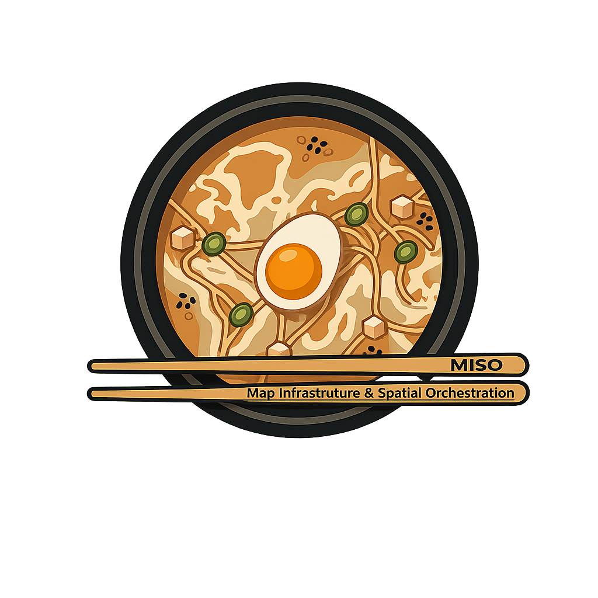

---
hide:
  - navigation
---

# MISO

## Map Infrastructure & Spatial Orchestration

  

> A cloud-native spatial data lake consolidating reconnaissance (ISR), mission planning (C2), logistics, and terrain/environment geodata under a common zone-based architecture.

!!! info "Status — Phase 0 (PoC)"
    **Owner:** Marco Sciaini (opendefense) · **Substrate:** local k3s + GitHub Actions + Pages
    **Focus domain for PoC:** Gelände & Umwelt · **Sample data:** GeoTIFF / Shapefile / KML / GPKG
    See the [Phase-0 roadmap](PHASE-0-ROADMAP.md) for the active plan.

---

## Reading paths

=== "I'm new — where do I start?"

    1. [Executive summary](01-summary.md) — what and why in one page
    2. [Context & motivation](02-context.md) — the problem this solves
    3. [Logical architecture](07-logical-architecture.md) — the zone model diagram
    4. [Phase-0 roadmap](PHASE-0-ROADMAP.md) — concrete next steps

=== "I'm the Platform Architect"

    - [Technology decisions](08-technology-decisions.md) — ADR overview
    - [ADR catalogue](adrs.md) — one file per decision
    - [Open questions & risks](10-risks-open-questions.md) — what's unresolved
    - [Requirements](05-requirements.md) — F-NN, NF-NN, workload catalog

=== "I'm a Data Owner"

    - [Stakeholders & roles](04-stakeholders.md) — responsibilities
    - [Zone governance](07-logical-architecture.md#74-governance-der-zonenübergänge) — approvals required
    - [Requirements](05-requirements.md) — quality + metadata expectations

=== "I'm onboarding the PoC"

    - [PoC overview](poc/README.md)
    - [k3s setup](poc/docs/k3s-setup.md) — step-by-step local cluster
    - [Phase-0 roadmap](PHASE-0-ROADMAP.md#arbeitsstränge) — the six work tracks

---

## Status dashboard

-   **Decided ADRs (7)**

    ---

    ADR-001 Objektspeicher · ADR-002 GeoParquet · ADR-003 COG · ADR-004 COPC · ADR-008 H3 · ADR-010 Prefect · ADR-011 k3s

-   **In discussion (4)**

    ---

    ADR-005 Iceberg vs Delta · ADR-006 technischer Katalog · ADR-007 Verarbeitungs-Engine · ADR-009 Serving-Komponenten

-   **Critical open questions**

    ---

    🔴 F-01 Klassifizierungsstufen · 🟡 F-08 Ziel-KRS · 🟡 F-10 Offline-Betrieb

-   **Critical risks**

    ---

    🔴 R-01 Data Owner access · 🔴 R-12 Akkreditierung · _(R-03 + R-16 neutralized by Phase-0 scope)_

---

## References

- [ID reference](id-reference.md) — jump to any `F-NN`, `NF-NN`, `W-NN`, `ADR-NNN`, `R-NN`
- [Glossary](GLOSSARY.md) — acronyms and domain terms

---

MISO is under active development. Specification content is in German (matches stakeholder language); navigation and meta docs are in English.
